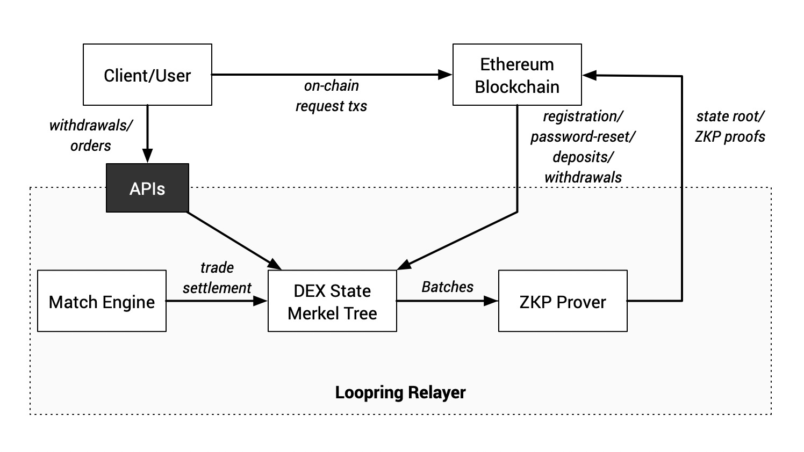

**Loopring** is the first scalable DEX protocol built using zkRollup technology and Ethereum as a data availability layer. Using Loopring, people can build a high-performance, orderbook-based, decentralized and **noncustodial** exchange. Due to the use of zkRollup, a layer-2 scalability solution, Loopring is capable of settling more than 2,000 trades per second on Ethereum 1.0. If you would like to learn more about Loopring's design and technical details, please check out Loopring's official website by clicking [here](https://loopring.org).

**Loopring Exchange** is the first decentralized trading platform built on top of the protocol. It is accessible [here](https://loopring.io), and currently leverages Loopring protocol version 3.6. The on-chain contract used to verify zero knowledge proofs (ZKPs) computed by the relayer is deployed on Ethereum's mainnet at the address [`0x0BABA1Ad5bE3a5C0a66E7ac838a129Bf948f1eA4`](https://etherscan.io/address/beta1.loopringio.eth), which is pointed to by the [`beta1.loopringio.eth`](https://etherscan.io/address/beta1.loopringio.eth) ENS domain too.

## Technical Advantages

The protocol makes it possible to build blazing-fast, decentralized and noncustodial exchanges that directly inherit Ethereum-grade security. Even under extreme circumstances, such as an exchange's frontend becoming unavailable, or a relayer going offline, users can still claim their own previously-deposited assets by providing valid Merkle proofs that are directly derivable from data stored on the Ethereum chain by the protocol itself.

The protocol does not guarantee the efficiency and fairness of off-chain order-matching, which is handled by the relaying entity that can in theory be a centralized piece of the overall decentralized solution. Different exchanges built on the same version of the protocol can come up with different relayer solutions and thus provide various options (each with their tradeoff) for the end user.

**Loopring exchange**'s relayer system, for example, is currently a centralized, closed source system that is capable of handling up to 200 trades per second, while guaranteeing Ethereum-level security.

## Loopring exchange's architecture

The overall architecture of **Loopring exchange** is shown below:

## Publicly exposed APIs

**Loopring exchange** exposes a set of both REST and websocket APIs that can be used by users directly or by developers to build custom frontends to the platform. These are mainly used to handle various off-chain requests, such as order submission/cancelation and withdrawals. Other user requests, including account registration, password reset, and deposits, must be submitted using on-chain transactions.
